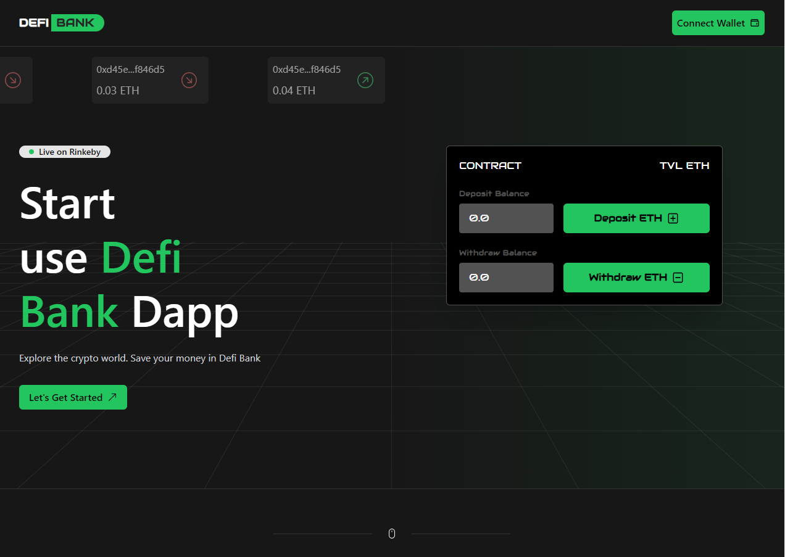

<h1 align="center">Welcome to DefiBank 👋</h1>
<p>
  
  <a href="https://twitter.com/0xedeon" target="_blank">
    
  </a>
</p>

> Defi Bank is a dapp created for ethereum 101 course

<a href="https://defibank.vercel.app/" target="_blank">
    
</a>

### ✨ [Demo](https://defibank.vercel.app/)

## Install

```sh
npm install
```

## Usage

```sh
npm run dev
```

## Tech
- NextJS
- React
- TypeScript
- TailwindCSS
- GraphQL
- The Graph
- Solidity
- Hardhat

## Show your support

Give a ⭐️ if this project helped you!

***
_This README was generated with ❤️ by [readme-md-generator](https://github.com/kefranabg/readme-md-generator)_
